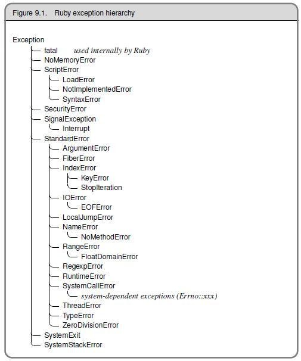

Ruby异常是一个对象，该类的异常或后代的实例。它代表一些特殊的条件。  
在Ruby程序出现错误时，会引发异常行为。 默认情况下，Ruby程序在抛出异常时终止。

我们可以在Ruby中声明一些异常处理程序。 异常处理程序是一些代码块，当一些其他代码块发生异常时，该块被执行。

异常的情况以两种方式处理。 可以终止程序或处理异常。 如果要处理异常，可以提供一个`rescue`子句，这样程序控制就可以流向`rescue`子句。

当异常提出但未处理时，全局变量`$!`包含当前异常，`$@`包含当前异常的回溯。

Ruby预定义的类，如`Exception`及其子项可以用来处理程序的错误。 在Ruby异常层次结构中，大多数子类都扩展了`ClassError`类。 这些是正常的异常

# 1 Ruby类异常

异常的内置子类如下：
- _NoMemoryError_
- _ScriptError_
- _SecurityError_
- _SignalException_
- _StandardError_
- _SystenExit_
- _SystemStackError_
- _fatal_ - 不可以拯救




**示例**

```ruby
def raise_exception     
  puts 'I am before the raise.'     
  raise 'oops! An error has occured'     
  puts 'I am after the raise'     
end     

raise_exception
```

执行上面代码，输出结果如下 -

```shell
F:\worksp\ruby>ruby exception-raise.rb
I am before the raise.
exception-raise.rb:6:in `raise_exception': oops! An error has occured (RuntimeError)
        from exception-raise.rb:9:in `<main>'

F:\worksp\ruby>
```

`raise`方法来自内核模块。


# 2 抛出异常 使用raise语句
除了编程异常出现的异常外，我们可以使用raise来强制抛出一个异常。
解释： 我们在raise后面增加了需要抛出的异常类型，由输出结果我们可以看到，最后抛出的异常类型为ArgumentError。

`raise`语句用于引发异常。

语法：

```ruby
raise
```

或者 -

```ruby
raise "Error Message"
```

或者 -

```ruby
raise ExceptionType, "Error Message"
```

或者 -

```ruby
raise ExceptionType, "Error Message" condition
```

第一个语法，重新引发当前的异常。 它用于异常处理程序，其中异常在传递之前被拦截。

第二个语法，创建一个新的`RuntimeError`异常。 然后这个异常被引发为调用堆栈。

第三个语法，使用第一个参数创建一个异常，然后将关联消息设置为第二个参数。

第四个语法，类似第三个的语法。 在这里可以添加任何条件语句来引发异常。

**示例**

```ruby
#!/usr/bin/ruby   
# exceptions-raise-statement.rb

begin     
    puts 'code before raise.'     
    raise 'exception occurred.'     
    puts 'code after raise.'     
rescue     
    puts 'I am rescued.'     
end     
puts 'code after begin block.'
```

执行上面代码，得到以下结果 -

```shell
F:\worksp\ruby>ruby exceptions-raise-statement.rb
code before raise.
I am rescued.
code after begin block.

F:\worksp\ruby>
```


# 3 处理异常 使用rescue子句

为了处理异常，引发异常的代码包含在begin-end块中。 使用rescue子句，我们可以说明我们要处理的异常类型。

示例：

```ruby
#!/usr/bin/ruby   
#file: exception-raise_rescue.rb

def raise_and_rescue     
  begin     
    puts 'Before the raise.'     
    raise 'An error occured.'     
    puts 'After the raise.'     
  rescue     
    puts 'Code rescued.'     
  end     
  
  puts 'After the begin block.'     
end     

raise_and_rescue
```

执行上面代码，得到以下结果 -

```shell
F:\worksp\ruby>ruby exception-raise_rescue.rb
Before the raise.
Code rescued.
After the begin block.

F:\worksp\ruby>
```

在上面的例子中，中断的代码不能完全运行。 异常处理代码在开始结束块(`begin-end`)之后恢复。

如果在`rescue`子句中未定义任何参数，则该参数默认为`StandardError`。 每个`rescue`子句指定多个异常捕获。 如果`raise`没有使用任何参数，则可能会重新提出异常。

`rescue`子句写在`begin/rescue`内，如果不是一个由`rescue`子句可处理的异常则将由下一个异常处理。

```ruby
begin  
code..  
rescue OneTypeOfException  
code..  
rescue AnotherTypeOfException  
 code..  
else  
  # Other exceptions  
end
```

在开始(`begin`)块中，每个具有引发异常的`rescue`子句将依次与每个参数进行比较。 当在`rescue`子句中指定的错误类型和异常名称相同或是该异常的超类时，则将匹配它。 
如果没有异常，完成了`begin`语句的主体则执行`else`子句。 如果发生异常，则不会执行`else`子句。

# 4 Exception对象

异常对象是普通对象。`rescue`子句中的变量可以保存被拯救的异常。

示例:

```ruby
begin   
  raise 'an exception'   
rescue ZeroDivisionError => e   
  puts "Exception Class: #{ e.class.name }"   
  puts "Exception Message: #{ e.message }"   
  puts "Exception Backtrace: #{ e.backtrace }"   
end
```

`Exception`类定义了两种方法用于返回有关异常的详细信息。 `message`方法返回一个定义错误说明的字符串。 `backtrace`方法返回一个字符串数组，表示在引发异常的时刻调用堆栈。

# 5 使用retry语句

通常在`rescue`子句中，捕获异常并在`begin`块阻止继续执行代码。 使用`retry`语句，捕获块代码可以在捕获异常之后还可以从`begin`块处恢复。

语法：

```ruby
begin  
   code....  
rescue  
    # capture exceptions  
    retry  # program will run from the begin block  
end
```

**示例**

```ruby
#!/usr/bin/ruby   

begin   
   x = Dir.mkdir "alreadyExist"   
   if x   
      puts "Directory created"   
   end   
rescue   
   y = "newDir"   
   retry   
end
```

上述程序运行如下：

**步骤1** - 在`begin`块中，编写代码以创建一个已经存在的目录。

**步骤2** - 这将抛出一个错误。

**步骤3** - 在`rescue`区，`y`被重新分配新值。

**步骤4** - `retry`语句将转到`begin`块。

**步骤5** - 将创建目录。

# 6 使用ensure语句

有一个`ensure`子句，保证在代码结尾处的一些处理。无论是否引发异常 `ensure`块始终运行。 它放置在最后一个`rescue`子句之后，并且在块的结束时执行。

无论是否发生异常，异常被`rescue`或代码被未捕获的异常终止，`ensure`块都将运行。

**语法**

```ruby
begin   
  code..  
   #..raise exception  
rescue   
   #.. exception is rescued  
ensure   
   #.. This code will always execute.  
end
```

**示例代码**

```ruby
#!/usr/bin/ruby   
# file : exception-ensure-statment.rb
begin   
  raise 'Exception'   
rescue Exception => e   
  puts e.message   
  puts e.backtrace.inspect   
ensure   
  puts "The ensure code will always run"   
end
```

执行上面示例代码，得到以下结果 -

```shell
F:\worksp\ruby>ruby exception-ensure-statment.rb
Exception
["exception-ensure-statment.rb:5:in `<main>'"]
The ensure code will always run

F:\worksp\ruby>
```

# 7 使用else语句

`else`子句始终存在于`rescue`子句之后和`before`子句之前。 如果没有引发异常，则只执行其他块。

语法：

```ruby
begin   
   code..   
   #..raise exception  
rescue   
   # .. exception is rescued  
else  
   #.. executes if there is no exception  
ensure   
   #..  This code will always execute.  
end
```

**示例**

```ruby
#!/usr/bin/ruby   
# file : exception-else-statment.rb

begin   
 # raise 'A test exception.'   
 puts "no exception is raised"   
rescue Exception => e   
  puts e.message   
  puts e.backtrace.inspect   
else   
   puts "else code will be executed as no exception is raised."   
ensure   
  puts "ensure code will run"   
end
```

执行上面代码，得到以下结果 -

```shell
F:\worksp\ruby>ruby exception-else-statment.rb
no exception is raised
else code will be executed as no exception is raised.
ensure code will run

F:\worksp\ruby>
```

# 8 Ruby catch和throw语句

Ruby `catch`和`throw`提供了一种在代码中不需要进一步工作的同时从执行中跳出来的方法。

`catch`定义了一个标有给定名称的块。 它用于跳出嵌套代码。 使用`catch`语句，块将被正常执行，直到遇到`throw`。

`catch`和`throw`方法比 `rescue` 和 `raise`快。 因此，更适合使用。

语法：

```ruby
throw :lablename  
#.. this  code will not be executed  
catch :lablename do  
#.. matching catch will be executed after a throw is encountered.  
end
```

或者 -

```ruby
throw :lablename condition  
#.. this code will not be executed  
catch :lablename do  
#.. matching catch will be executed after a throw is encountered.  
end
```

**示例**

```ruby
#!/usr/bin/ruby   
# file : exception-catch-throw.rb

def promptAndGet(prompt)   
   print prompt   
   res = readline.chomp   
   throw :quitRequested if res == "!"   
   return res   
end   

catch :quitRequested do   
   name = promptAndGet("Name: ")   
   age = promptAndGet("Occupation: ")   
   # ..   
   # process information   
end   
promptAndGet("Name:")
```

执行上面代码，得到以下结果 -

```shell
F:\worksp\ruby>ruby exception-catch-throw.rb
Name: Maxsu
Occupation: Occupation
Name:Minsu

F:\worksp\ruby>
```

//更多请阅读：https://www.yiibai.com/ruby/exceptions.html


